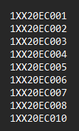
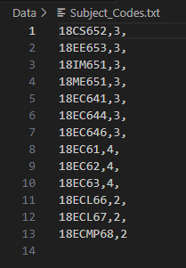
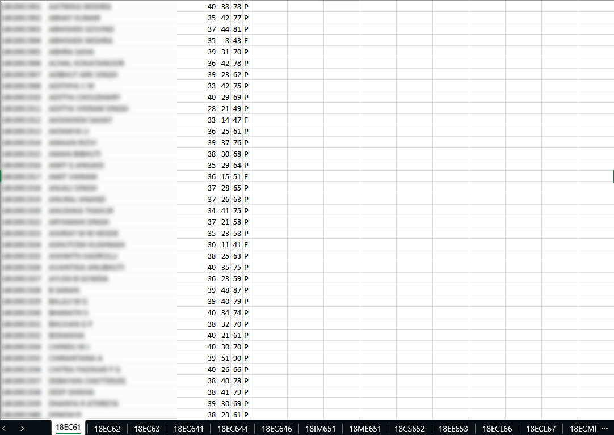

# VTU Result Scraper with CAPTCHA Bypass

This is a set of python programs created to scrape the results of the students whose USN is provided to program which automatically solves the CAPTCHA and stores the result in a text file.

## Features

This contains three main python scripts which are designed to perfrom as follows:

- scraper.py which perfroms the actual scraping of the data and storing the data in the text file.
- excel_file.py which organizes the data in the text file into an Excel Workbook.
- cgpa.py which adds the cgpa of the individuals into the Excel Workbook.

## Prerequisites

- Needs Chrome Web browser with latest version of supporting ChromeDriver.ChromeDriver must also be in PATH.
- Pytesseract installed on the PC and in PATH.
- In case the the above mentioned libraries are not on path then you will have to specify the installed path of these libraries in the `scraper.py` program.

## Installation

Follow these steps to install the project to run on your machine.

- Clone this repository into your required directory.

- Open a terminal the directory and then run the following command:

```bash
  pip install -r requirements.txt
```

## Running The Program

- Run the `scraper.py` progam and provide the USN range input to the program. It supports either the USN input as a text file or as a range of USN.The USN values if provided as a text file must be as follows:

 <p align="center">
  
</p>

- Wait for the scraper program to finish grabbing the results from the website.

- In case you wish to have it in an organized manner. Run the `excel_file.py` program to store the result in an excel sheet. Do note that you have to provide the subject codes and their respective credits in the `subject_codes.txt` file.
  An example of it is shown below:

 <p align="center">
  
</p>

- If you wish to add the CGPA of the students too into the Excel Sheet then run `cgpa.py` which stores the CGPA into `Marks.xlsx` file.

<p align="center">
  
</p>

## Basic Troubleshooting

There can few minor issues one can expect to encounter, a few of which are as follows:

- ChromeDriver and Pytesserct not on PATH which is mentioned in the prerequisites
  Section.
- Errors regarding loading the Excel File. Do make sure that the excel file is closed and is empty before running the `excel_file.py` program.
- There a two CAPTCHA solving techniques implemented, one of which is based on Pytesseract and the other one is a deep trained model whose files have been added in the data folder. It is not a 100% efficient in solving the CAPTCHA but manages to have a high accuracy.

## Update -23/09/23

Added a feature to capture the reval results of the students.

- Run `reval_scraper.py` to get the reval results of the students.
- Run `result_updater.py` to update the results of the students with the reval results.
- Then one can run `excel_file.py` to generate the excel data for the marks and then `cgpa.py` to enter the cgpa.

## Update -23/02/24

Added a feature to compute the marks and overall percentage of the students.

- Run `marks.py` to get the total marks of the students.
- It is suggested to run `marks.py` after running the `cgpa.py` program as it is written to be run in that manner. 

## Issues

- The `completed.txt`file does not work perfectly as intended. It is a minor bug and does not compromise functionality. It is advised to start the program and not stop it in between as the program cannot retain the last USN which it stopped at.
